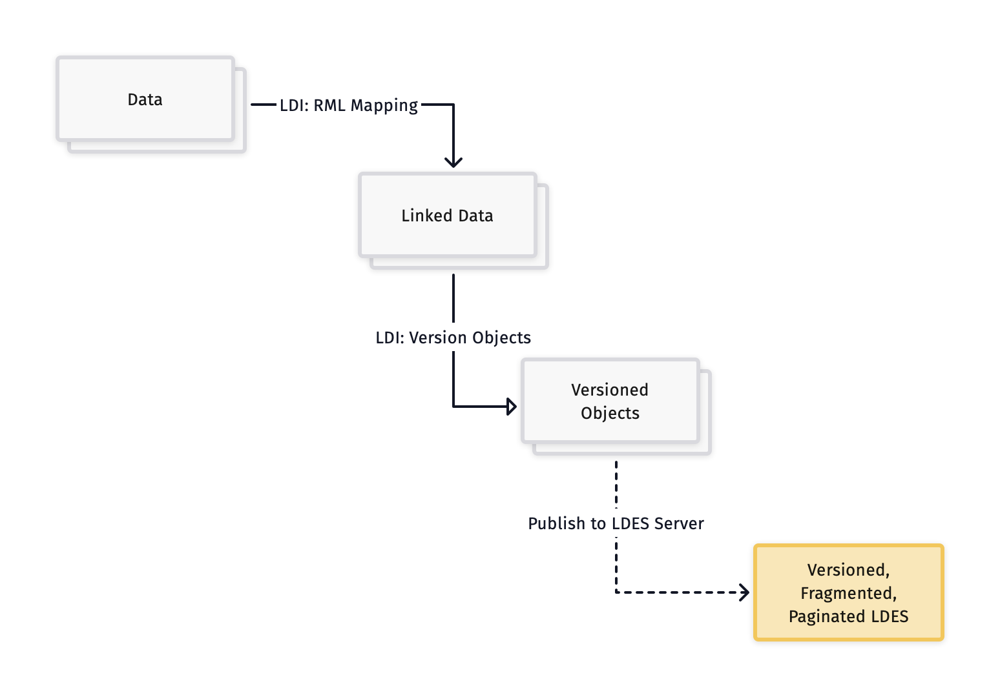

# Onboarding Docs for non-linked data to LDES

Welcome to our GitHub repository, dedicated to providing a comprehensive guide and toolkit for transforming non-linked datasets into an OSLO (Open Standards for Linked Organizations) compliant Linked Data Event Stream (LDES) utilizing the Flanders Smart Data Space building blocks.

In this repository, you will find the necessary resources and instructions to seamlessly convert your non-linked datasets into an OSLO compliant LDES stream, leveraging the power of the Flanders Smart Data Space building blocks. This documentation aims to simplify the process and ensure that your data aligns with the standards and practices set forth by OSLO and the Flemish Smart Data Space initiative.

